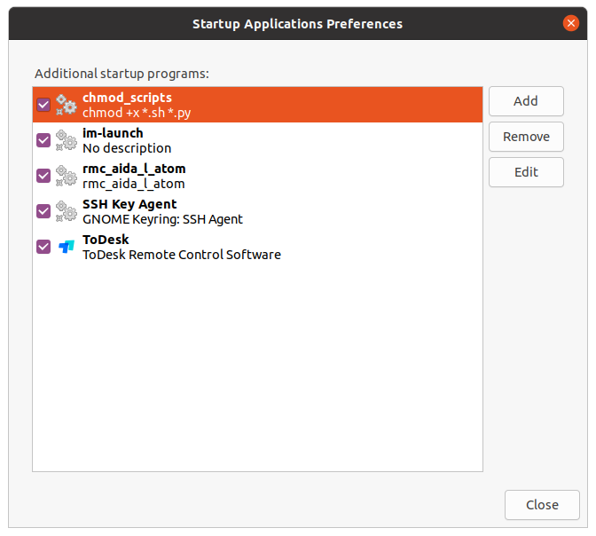

# 双臂遥操作二次开发Demo
程序环境：python3.9
## 文件结构
``` python
aida_atom_python
├─ Readme.md #自述文件
├─ Robotic_Arm #API2 1.0.5
│  ├─ libs
│  ├─ rm_ctypes_wrap.py
│  └─ rm_robot_interface.py
├─ config.ini # 参数配置文件
├─ data_filter.py # 平滑滤波器代码
└─ main.py # 主函数
```
## 程序环境配置
### 安装anaconda3
```
bash Anaconda3-2023.09-0-Linux-aarch64.sh
```
根据页面提示安装conda环境(需要输入很多enter和yes)
### 创建conda虚拟环境
```
conda create -n test python=3.9
conda activate test
pip install pyserial
```
### 运行程序
运行程序前，请确保主臂处于零位，运行中一旦出现问题，请马上急停
```
conda activate test
python3 main.py
```
运行程序后，双臂会首先与主臂同步，随后开启高跟随模式

## 代码解析
### 1. 导入模块
```python
import serial
import binascii
import time
import threading
import configparser
from data_filter import DataFilter
from Robotic_Arm.rm_robot_interface import *
serial：用于串口通信，读取主臂的关节角度数据。
binascii：用于将二进制数据转换为十六进制字符串。
time：用于控制程序的运行时间间隔。
threading：用于创建和管理多线程，实现并行处理。
configparser：用于读取配置文件，动态加载参数。
DataFilter：用于对关节角度数据进行滤波处理。
Robotic_Arm.rm_robot_interface：用于控制机械臂的运动。
```
### 2. 全局变量
```python
Arm_dof = 7
master_dof = 7

l_ip = "169.254.128.18"
r_ip = "169.254.128.19"

l_port = "/dev/rmUSB0"
r_port = "/dev/rmUSB1"

l_data_filter = DataFilter()
r_data_filter = DataFilter()

filter_depth = 10

l_joints = []
r_joints = []
l_grip = 0
r_grip = 0
```
>data_lock = threading.Lock()
Arm_dof 和 master_dof：分别表示从臂和主臂的自由度（DOF）。
l_ip 和 r_ip：左臂和右臂的 IP 地址。
l_port 和 r_port：主臂和从臂的串口号。
l_data_filter 和 r_data_filter：用于对左臂和右臂的关节角度数据进行滤波。
filter_depth：滤波器的深度。
l_joints 和 r_joints：存储左臂和右臂的关节角度。
l_grip 和 r_grip：存储左臂和右臂的夹爪状态。
data_lock：线程锁，用于保护共享数据的访问。
3. 读取配置文件
```python
def read_config():
    config = configparser.ConfigParser()
    config.read('config.ini')
    global Arm_dof, master_dof, l_ip, r_ip, l_port, r_port, filter_depth
    try:
        Arm_dof = int(config.get('DOF', 'slave_dof'))
        master_dof = int(config.get('DOF', 'master_dof'))

        l_ip = config.get('IPAddresses', 'left_arm_ip')
        r_ip = config.get('IPAddresses', 'right_arm_ip')

        l_port = config.get('SerialPorts', 'master_port')
        r_port = config.get('SerialPorts', 'slave_port')

        filter_depth = config.get('DataFilter', 'depth')
    except:
        return False
    return True
从 config.ini 文件中读取配置参数，包括自由度、IP 地址、串口号和滤波器深度。
如果读取失败，返回 False，否则返回 True。
```
4. 初始化串口通信
```python
def arm_conf():
    baudrate = 460800
    hex_data = "55 AA 02 00 00 67"

    l_ser = serial.Serial(l_port, baudrate, timeout=0)
    r_ser = serial.Serial(r_port, baudrate, timeout=0)

    bytes_to_send = binascii.unhexlify(hex_data.replace(" ", ""))
    l_ser.write(bytes_to_send)
    r_ser.write(bytes_to_send)
    time.sleep(1)

    return l_ser, r_ser, bytes_to_send
```
初始化主臂和从臂的串口通信。
发送初始化指令 hex_data 到主臂和从臂。
返回串口对象和发送的字节数据。
### 5. 数据解析
```pyhton
def get_Joint(hex_received):
    if len(hex_received) == 94:
        # 解析7自由度的关节角度
        J1 = hex_received[14:22]
        J2 = hex_received[24:32]
        J3 = hex_received[34:42]
        J4 = hex_received[44:52]
        J5 = hex_received[54:62]
        J6 = hex_received[64:72]
        J7 = hex_received[74:82]
        G7 = hex_received[84:92]

        Joints = [bytes_to_signed_int(bytearray.fromhex(J1)) / 10000.0,
                  bytes_to_signed_int(bytearray.fromhex(J2)) / 10000.0,
                  bytes_to_signed_int(bytearray.fromhex(J3)) / 10000.0,
                  bytes_to_signed_int(bytearray.fromhex(J4)) / 10000.0,
                  bytes_to_signed_int(bytearray.fromhex(J5)) / 10000.0,
                  bytes_to_signed_int(bytearray.fromhex(J6)) / 10000.0,
                  bytes_to_signed_int(bytearray.fromhex(J7)) / 10000.0]
        Gripper = bytes_to_signed_int(bytearray.fromhex(G7))

    elif len(hex_received) == 84:
        # 解析6自由度的关节角度
        J1 = hex_received[14:22]
        J2 = hex_received[24:32]
        J3 = hex_received[34:42]
        J4 = hex_received[44:52]
        J5 = hex_received[54:62]
        J6 = hex_received[64:72]
        G6 = hex_received[74:82]

        Joints = [bytes_to_signed_int(bytearray.fromhex(J1)) / 10000.0,
                  bytes_to_signed_int(bytearray.fromhex(J2)) / 10000.0,
                  bytes_to_signed_int(bytearray.fromhex(J3)) / 10000.0,
                  bytes_to_signed_int(bytearray.fromhex(J4)) / 10000.0,
                  bytes_to_signed_int(bytearray.fromhex(J5)) / 10000.0,
                  bytes_to_signed_int(bytearray.fromhex(J6)) / 10000.0]
        Gripper = bytes_to_signed_int(bytearray.fromhex(G6))
    else:
        raise Exception("主臂数据错误")

    return Joints, Gripper
```
解析从串口接收到的十六进制数据，提取关节角度和夹爪状态。
根据数据长度判断主臂的自由度（6自由度或7自由度）。
### 6. 获取主臂角度
```python
def get_master_act(l_ser, r_ser, byte_send):
    l_ser.write(byte_send)
    r_ser.write(byte_send)
    l_bytes_received = l_ser.read(l_ser.inWaiting())
    r_bytes_received = r_ser.read(r_ser.inWaiting())
    l_hex_received = binascii.hexlify(l_bytes_received).decode('utf-8').upper()
    r_hex_received = binascii.hexlify(r_bytes_received).decode('utf-8').upper()
    l_joints, l_grip = get_Joint(l_hex_received)
    r_joints, r_grip = get_Joint(r_hex_received)

    return l_joints, r_joints, l_grip, r_grip
```
向主臂和从臂发送指令，读取返回的数据。
解析返回的数据，获取左臂和右臂的关节角度和夹爪状态。
### 7. 数据滤波
```python
def filter_joints(joints, data_filter):
    joint_filter = [0 for _ in range(Arm_dof)]
    joint_filter[0] = data_filter.Refilter(0, joints[0], filter_depth)
    joint_filter[1] = data_filter.Refilter(1, joints[1], filter_depth)

    if Arm_dof == master_dof:
        for i in range(2, Arm_dof):
            joint_filter[i] = data_filter.Refilter(i, joints[i], filter_depth)
    elif Arm_dof < master_dof:
        for i in range(2, Arm_dof):
            joint_filter[i] = data_filter.Refilter(i, joints[i + 1], filter_depth)
    elif Arm_dof > master_dof:
        for i in range(2, master_dof):
            joint_filter[i + 1] = data_filter.Refilter(i + 1, joints[i], filter_depth)

    return joint_filter
```
对关节角度数据进行滤波处理，平滑数据波动,并根据主从臂不同的自由度得出最终需要透传的角度。
### 8.数据平滑滤波器类别解析
`类解析：DataFilte`
#### 1. 类的初始化
```
class DataFilter:
    def __init__(self):
        self.filter_data_buf_ = [[0 for _ in range(200)] for _ in range(8)]
        self.filter_data_buf_sum_ = [0 for _ in range(8)]
        self.filter_data_buf_i_ = [0 for _ in range(8)]
        self.filter_data_buf_k_ = [0 for _ in range(8)]
```
>filter_data_buf_：一个二维数组，用于存储每个关节的滤波数据缓冲区。每个关节有 200 个数据点的缓冲区。
filter_data_buf_sum_：一个数组，用于存储每个关节的滤波数据总和。
filter_data_buf_i_：一个数组，用于记录每个关节当前缓冲区的索引位置。
filter_data_buf_k_：一个数组，用于记录每个关节缓冲区中实际存储的数据点数量。
2. 数据滤波方法

```
def Refilter(self, joint_id: int, in_data: float, in_count: int) -> float:
    if in_count == 0:
        return in_data

    j = 0
    re_average_data = 0.0

    self.filter_data_buf_k_[joint_id] += 1

    if self.filter_data_buf_k_[joint_id] > in_count:
        self.filter_data_buf_k_[joint_id] = in_count

        self.filter_data_buf_sum_[joint_id] = self.filter_data_buf_sum_[joint_id] - self.filter_data_buf_[joint_id][0]

        for j in range(1, in_count):
            self.filter_data_buf_[joint_id][j - 1] = self.filter_data_buf_[joint_id][j]
        self.filter_data_buf_[joint_id][in_count - 1] = in_data

        self.filter_data_buf_sum_[joint_id] += in_data

        re_average_data = self.filter_data_buf_sum_[joint_id] / in_count
    else:
        self.filter_data_buf_[joint_id][self.filter_data_buf_i_[joint_id]] = in_data

        self.filter_data_buf_i_[joint_id] += 1

        self.filter_data_buf_sum_[joint_id] += in_data

        re_average_data = self.filter_data_buf_sum_[joint_id] / self.filter_data_buf_i_[joint_id]

    return re_average_data
```
>joint_id：关节的编号（0 到 7）。
in_data：当前输入的关节角度数据。
in_count：滤波窗口的大小（即缓冲区中存储的数据点数量）。
功能解析：
特殊情况处理：
如果 in_count 为 0，直接返回输入数据 in_data，不进行滤波处理。
缓冲区已满：
如果缓冲区中存储的数据点数量超过 in_count，则需要滑动窗口：
从缓冲区中移除最早的数据点（self.filter_data_buf_[joint_id][0]）。
更新缓冲区的总和（self.filter_data_buf_sum_[joint_id]）。
将新的数据点 in_data 添加到缓冲区的末尾。
计算平均值 re_average_data。
缓冲区未满：
如果缓冲区中存储的数据点数量未达到 in_count，则直接将新的数据点 in_data 添加到缓冲区中。
更新缓冲区的总和（self.filter_data_buf_sum_[joint_id]）。
计算当前缓冲区中所有数据点的平均值 re_average_data。
返回值：
返回滤波后的关节角度数据 re_average_data。
3. 重置滤波器
```
def ResetFilterData(self):
    self.filter_data_buf_sum_ = [0 for _ in range(8)]
    self.filter_data_buf_i_ = [0 for _ in range(8)]
    self.filter_data_buf_k_ = [0 for _ in range(8)]
```
>功能：
重置滤波器的所有数据，包括缓冲区总和、索引和数据点数量。
通常在程序初始化或需要重新开始滤波时调用。
总结
DataFilter 类实现了一个基于滑动窗口的平滑滤波器，用于对关节角度数据进行滤波处理。其主要功能包括：
滑动窗口滤波：通过滑动窗口的方式，动态更新缓冲区中的数据点，并计算平均值。
动态窗口大小：支持动态调整滤波窗口的大小（in_count）。
数据重置：提供方法重置滤波器的所有数据，以便重新开始滤波。
这个滤波器适用于需要平滑数据波动和减少噪声的场景，非常适合机械臂关节角度数据的处理。
## 如何关闭具身中的遥操作程序
打开Start Applications Preferences应用程序

将rmc_adia_l_ation取消勾选，这样开机就不会自动运行遥操作程序
